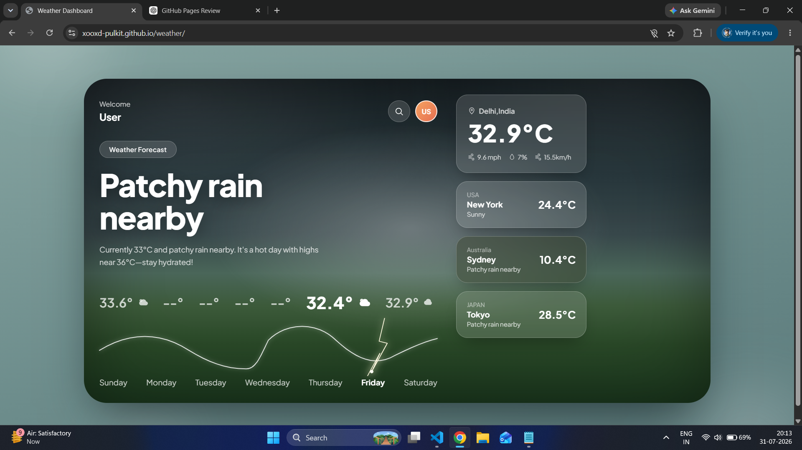
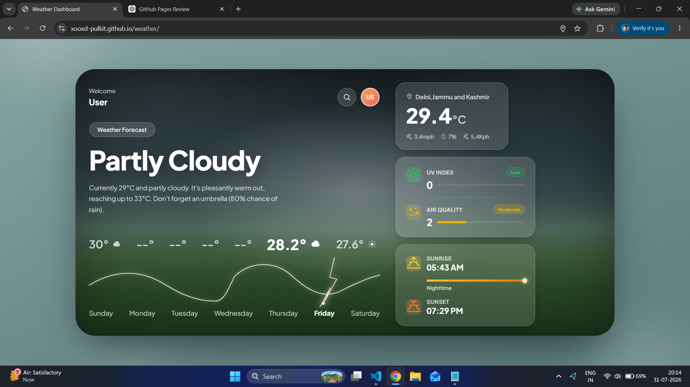

# 🌦️ Weather Dashboard

> A modern, responsive weather dashboard built with **Vanilla JavaScript**, featuring real-time weather data, dynamic themes, geolocation support, and an interactive user experience.

<p align="center">
  
</p>

<p align="center">
  <a href="https://xooxd-pulkit.github.io/weather/">
    
  </a>
  
  
  
</p>

---

## 🚀 Live Demo

🔗 **https://xooxd-pulkit.github.io/weather/**

---

# ✨ Features

- 🌍 Search weather for any city worldwide
- 📍 Automatic weather using browser geolocation
- 🌡️ Real-time temperature and "feels like" temperature
- ☁️ Current weather conditions
- 💨 Wind speed
- 💧 Humidity
- 👁️ Visibility
- 📊 Air Quality Index (AQI)
- 🌅 Sunrise & Sunset timings
- 🌙 Dynamic Day/Night UI
- ⚡ Animated weather icons
- 🎨 Background changes based on weather
- 🔄 Loading animations
- 📱 Responsive dashboard
- ⚠️ Error handling for invalid city names

---

# 🛠️ Built With

- HTML5
- CSS3
- JavaScript (ES6)
- WeatherAPI
- Fetch API
- Geolocation API
- SVG Animations

---

# 📸 Screenshots

## Home Dashboard


---

## Search Result



---


# 📂 Project Structure

```
weather/
│
├── index.html
├── style.css
├── script.js
├── assets/
│   └── screenshots/
└── README.md
```

---

# 💡 What I Learned

This project helped me understand:

- Working with REST APIs
- Fetch API & asynchronous JavaScript
- DOM manipulation
- Event handling
- Browser Geolocation
- Loading states
- Error handling
- Responsive UI development
- Deploying projects using GitHub Pages

---

# ⚙️ Installation

Clone the repository

```bash
git clone https://github.com/xooxd-pulkit/weather.git
```

Open the project

```bash
cd weather
```

Run

```
Open index.html
```

or use VS Code Live Server.

---

# 🎯 Future Improvements

- Favorite cities
- Weather charts
- Hourly forecast graphs
- Multiple language support
- PWA support
- Offline caching

---

# 👨‍💻 Author

**Pulkit Gupta**

GitHub:
https://github.com/xooxd-pulkit

---

# ⭐ Support

If you enjoyed this project, consider giving it a ⭐ on GitHub.

It motivates me to build more projects and continue improving as a developer.